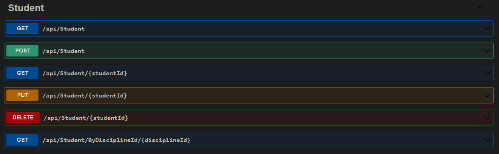
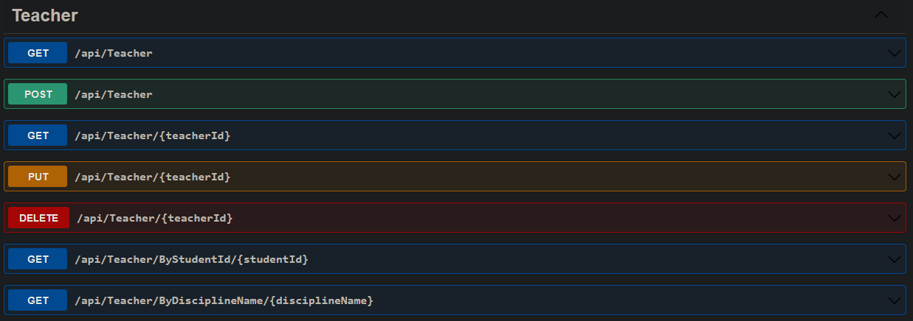

# Smart School Web Api

API desenvolvida em .NET 6 & Entity Framework para o projeto Smart School desenvolvido em Angular.

## Endpoints

## Development server

Execute `dotnet run` na raiz do projeto para rodar em servidor de desenvolvimento pela url `http://localhost:5235/`.
